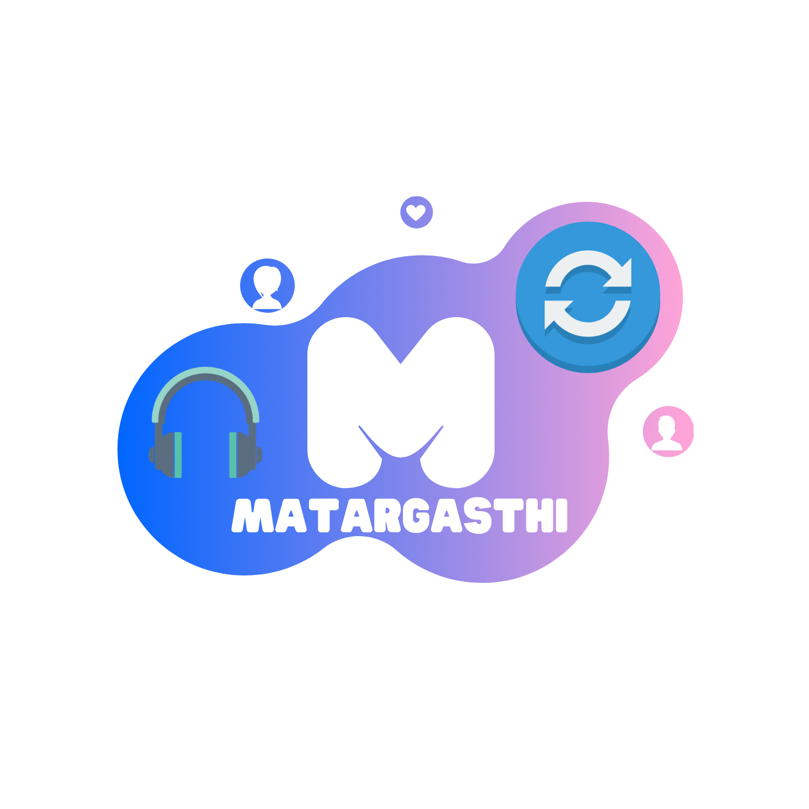

# Matargasthi-react-native-app

### This the official code of Matargasthi app ...

#### Matargasthi - an app to stream videos from YouTube and Google Drive together with friends. It gives users a surreal visual and audio experience in a virtual multiplex.

#### "Matargashti" is an amalgamation of various unique features to give the users a surreal visual and audio experience in a virtual multiplex.
####      • A synchronized video player for every player in the room to view the same video simultaneously.
####      • Built in chat box in every room for active communication among the live audience. 
####      • Room settings that can be personalized according to customer preferences

You can also find this app in Google Playstore....

https://play.google.com/store/apps/details?id=com.panthotech.matargasthi

The Team who have made this app. 
<a href="https://github.com/prasenjitghose36">Prasenjit Ghosh</a> 
<a href="https://github.com/patelaryan7751">Aryan Patel</a> 
<a href="https://github.com/sAURYAMAN777">Sauryaman Nayak</a> 
<a href="https://github.com/rajdas2001">Raj Das</a> 

